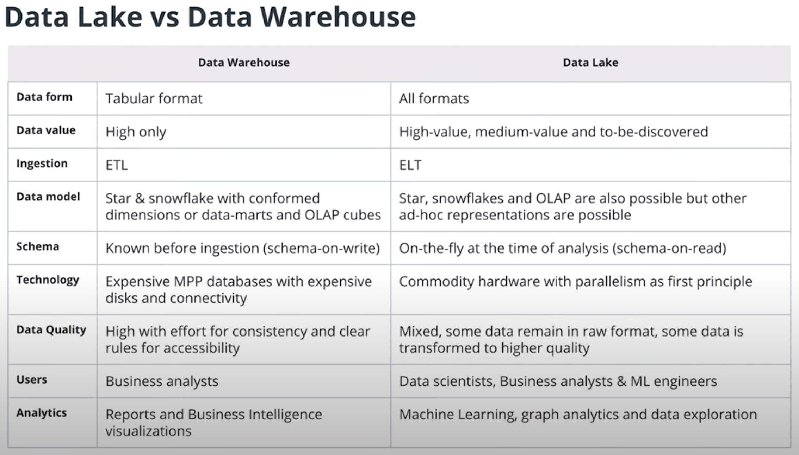

# Data Lakes

## Evolution of the Data Warehouse
**Question:** Is there anything wrong with this approach that we need something different?
* No, data warehousing is a rather mature field with lots of cumulative experience over the years, tried and true technologies
* Dimensional modelling is still extremely relevant to this day
* For many organizations, a data warehouse is still the best way to go. Perhaps the biggest change would be going from on-premise deployment to a cloud deployment

**Question:** So why do we need a data lake?
* In recent years, many factors drove the evolution of the data warehouse
    * The abundance of unstructured data (text, xml, json, logs, sensor data, images, voice, etc.)
    * Unprecedented data volumes (social, IoT, machine-generated)
    * The rise of Big Data technologies like HDFS, Spark
    * New types of data analysis gaining momentum (predective analytics, recommender systems, graoth analytics)
    * Emergence of new roles like the data scientist

* The data lake shares the goals of the data warehouse of supporting business insights beyound the day-to-day transactional data handling
*  The data like is a new form of data warehouse that evolved to cope with:
    * The variety of data formats and structuring
    * The aglie and ad-hoc nature of data exploration activities needed by new rolese like the data scientist
    * The wide spectrum data transformation needed by advanced analytics like machine learning, graph analytics and recommender systems

* bottled water vs lake analogy

